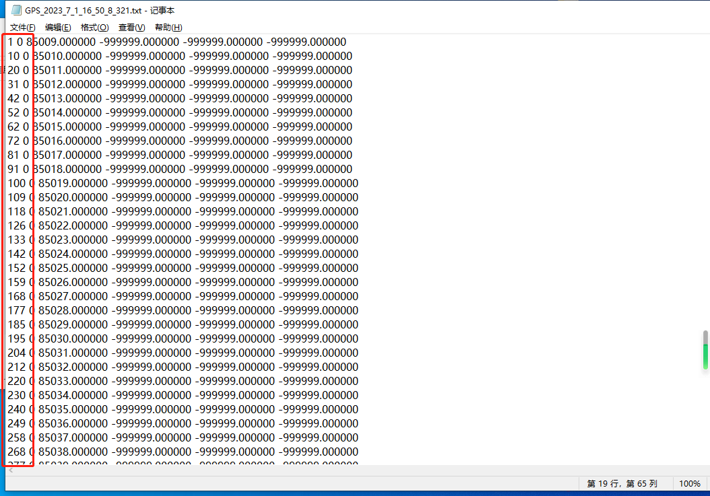
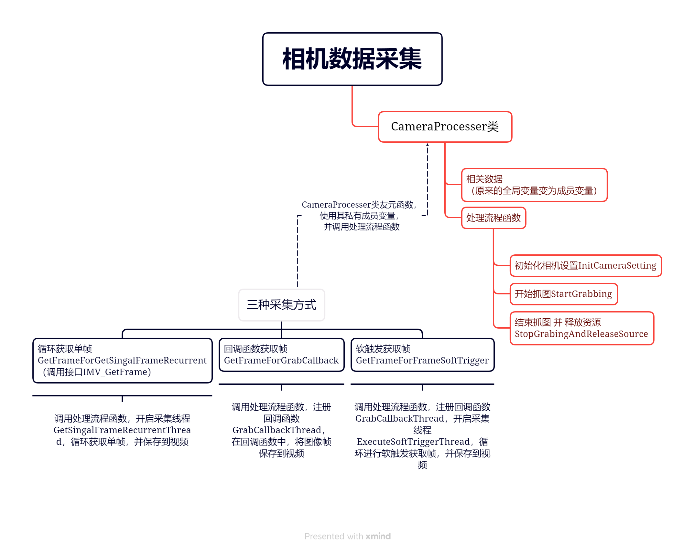
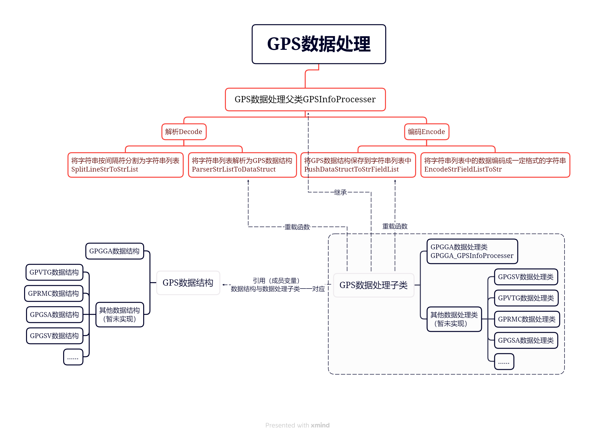

# 获取硬件采集的数据-从零开始构建项目记录

- [获取硬件采集的数据-从零开始构建项目记录](#获取硬件采集的数据-从零开始构建项目记录)
	- [实现思路：](#实现思路)
	- [一、创建VS控制台程序并配置环境](#一创建vs控制台程序并配置环境)
		- [1.1、配置相机运行环境](#11配置相机运行环境)
		- [1.2、配置OpenCV环境](#12配置opencv环境)
	- [二、获取到彩色图像](#二获取到彩色图像)
		- [2.1、确保正确获取到灰度图（基于SoftTrigger示例项目）](#21确保正确获取到灰度图基于softtrigger示例项目)
		- [2.2、将 `BayerRG12`格式转换为 `RGB8`彩色图（基于ImageConvert示例项目）](#22将-bayerrg12格式转换为-rgb8彩色图基于imageconvert示例项目)
		- [2.3、转换为Mat对象并保存为文件](#23转换为mat对象并保存为文件)
		- [2.4、验证1s可以保存多少帧图像](#24验证1s可以保存多少帧图像)
		- [3.5、逻辑整理与流程优化](#35逻辑整理与流程优化)
	- [三、获取以及解析GPS串口数据](#三获取以及解析gps串口数据)
		- [3.1、读取GPS串口数据](#31读取gps串口数据)
		- [3.2、读取GPS串口数据线程处理流程](#32读取gps串口数据线程处理流程)
		- [3.3、GPS数据解析与编码流程](#33gps数据解析与编码流程)
		- [3.4、GPS数据处理相关代码](#34gps数据处理相关代码)
		- [3.5、将编码后的数据保存到文件](#35将编码后的数据保存到文件)
	- [四、获取激光雷达数据](#四获取激光雷达数据)


## 实现思路：

从零开始构建控制台程序，并以相机获取数据示例代码【SoftTrigger】【ImageConvert】为基础，再加入GPS与激光雷达数据的获取代码。

基于相机SDK版本2.4.0（MV Viewer）：http://download.huaraytech.com/pub/sdk/Ver2.4.0/Windows/Base_ver/

## 一、创建VS控制台程序并配置环境

### 1.1、配置相机运行环境

1.1.1、拷贝头文件与Lib库到项目目录下，并将其加入配置到项目中

1.1.2、将MVSDKmd.lib加入到【链接器】-【输入】-【附加依赖项】中

1.1.3、将DLL库目录配置到【调试】-【环境】中：
PATH=C:\Program Files\HuarayTech\MV Viewer\Runtime\x64;%PATH%

### 1.2、配置OpenCV环境

**略，类似于1.1**

## 二、获取到彩色图像

### 2.1、确保正确获取到灰度图（基于SoftTrigger示例项目）

2.1.1、将 `SoftTrigger.cpp`拷贝到项目目录下，提取函数声明到同名头文件中

2.1.2、将输出相机信息、选择相机等常用的函数分别声明和定义到 `Common.h`、`Common.cpp`中

2.1.3、将 `SoftTrigger.cpp`中的main函数中的内容拷贝到 `main.cpp`的main函数中，编译并排除一些错误

2.1.4、设置相机属性：包括，设置 `PixelFormat`属性为 `Mono8`，~~`ExposureAuto`属性为 `Continuous`~~(在设置 `TriggerMode`属性为 `On`之后，`ExposureAuto`属性不存在，因此设置 `ExposureAuto`属性会报错)、`BalanceWhiteAuto`属性为 `Continuous`。

2.1.5、验证BayerRG12是否写入相机配置是否正确

根据以下两个接口，保存相机描述（`IMV_DownLoadGenICamXML`，参数的值所有的值的列表）以及当前的相机配置(`IMV_SaveDeviceCfg`)到本地，查看 `PixelFormat`属性是否对应是 `BayerRG12`的值

```C++
//// 下载设备描述XML文件到CameraConfig.zip，解压后会有一个xml保存了相机参数可设置的所有值
//ret = IMV_DownLoadGenICamXML(devHandle, "CameraConfig.zip");
//if (IMV_OK != ret)
//{
//	printf("configuration of camera save failed!\n", ret);
//	return ret;
//}

// 保存设备配置到指定的位置CameraConfig.xml
ret = IMV_SaveDeviceCfg(devHandle, "CameraConfig.xml");
if (IMV_OK != ret)
{
	printf("configuration of camera save failed!\n", ret);
	return ret;
}
```

代码运行后，得到以下结果，可以判断 `BayerRG12`以及 `BalanceWhiteAuto`被正确设置。

`CameraConfig.zip`中 `general_60621_20180817094321.xml`

```xml
<PixelFormat>17825809</PixelFormat>

.....

<BalanceWhiteAuto>2</BalanceWhiteAuto>
```

`CameraConfig.xml`

```xml
<EnumEntry Name="BayerRG12" NameSpace="Standard">
	<pIsAvailable>PixelFormatBayerRG12ImplExpr</pIsAvailable>
	<Value>17825809</Value>
</EnumEntry>

.....

<EnumEntry Name="Continuous" NameSpace="Standard">
	<ToolTip>White balancing is constantly adjusted by the device.</ToolTip>
	<Description>White balancing is constantly adjusted by the device.</Description>
	<DisplayName>Continuous</DisplayName>
	<Value>2</Value>
</EnumEntry>
```

`PixelFormat`和 `BalanceWhiteAuto`的设置已确认没有问题。

```C++
// 打开相机 
// ......

//设置图像格式
ret = IMV_SetEnumFeatureSymbol(devHandle, "PixelFormat", "Mono8"/*"BayerRG12"*/);
if (IMV_OK != ret)
{
    printf("Get feature value failed! ErrorCode[%d]\n", ret);
    return ret;
}

// // 设置自动曝光（在Mono8的像素格式下会报错）
// ret = IMV_SetEnumFeatureSymbol(devHandle, "ExposureAuto", "Continuous");
// if (IMV_OK != ret)
// {
//     printf("Get feature value failed! ErrorCode[%d]\n", ret);
//     return ret;
// }

// // 设置自动曝光
// ret = IMV_SetEnumFeatureSymbol(devHandle, "ExposureAuto", "Continuous");
// if (IMV_OK != ret)
// {
// 	   printf("Get feature value failed! ErrorCode[%d]\n", ret);
//     return ret;
// }

// 设置软触发配置 
// ......
```

2.1.6、在相机数据回调函数中将 `IMV_Frame`数据，保存到 `cv::Mat`中

```C++
// 数据帧回调函数
// Data frame callback function
void onGetFrame(IMV_Frame* pFrame, void* pUser)
{
	if (pFrame == NULL)
	{
		printf("pFrame is NULL\n");
		return;
	}

	cv::Mat image = cv::Mat(pFrame->frameInfo.height, pFrame->frameInfo.width, CV_8U, (uint8_t*)((pFrame->pData)));

	printf("Get frame blockId = %llu\n", pFrame->frameInfo.blockId);

	return;
}
```

### 2.2、将 `BayerRG12`格式转换为 `RGB8`彩色图（基于ImageConvert示例项目）

2.2.1、将 `ImageConvert.cpp`拷贝到项目目录下，提取函数声明到同名头文件中

2.2.2、设置相机属性：包括，设置 `PixelFormat`属性为 `BayerRG12`

```C++
// 打开相机 
// ......

//设置图像格式
ret = IMV_SetEnumFeatureSymbol(devHandle, "PixelFormat", /*"Mono8"*/"BayerRG12");
if (IMV_OK != ret)
{
    printf("Get feature value failed! ErrorCode[%d]\n", ret);
    return ret;
}

// 设置软触发配置 
// ......
```

2.2.3、将相机句柄到回调函数 `onGetFrame`，用于调用 `imageConvert`函数

```C++
// 注册数据帧回调函数
// Register data frame callback function
ret = IMV_AttachGrabbing(devHandle, onGetFrame, &devHandle); // 传入相机句柄
if (IMV_OK != ret)
{
    printf("Attach grabbing failed! ErrorCode[%d]\n", ret);
    break;
}
```

2.2.4、在回调函数 `onGetFrame`中调用 `imageConvert`函数，默认会保存成 `.bin`格式文件

```C++
// 数据帧回调函数
// Data frame callback function
void onGetFrame(IMV_Frame* pFrame, void* pUser)
{
	if (pFrame == NULL)
	{
		printf("pFrame is NULL\n");
		return;
	}

	IMV_HANDLE* devHandle = (IMV_HANDLE*)pUser;

	imageConvert(*devHandle, *pFrame, gvspPixelBGR8); // 将图像数据转为RGB8格式

	//cv::Mat image = cv::Mat(pFrame->frameInfo.height, pFrame->frameInfo.width, CV_8U, (uint8_t*)((pFrame->pData)));

	printf("Get frame blockId = %llu\n", pFrame->frameInfo.blockId);

	return;
}
```

### 2.3、转换为Mat对象并保存为文件

2.3.1、修改 `imageConvert`函数，将数据转换为Mat对象并保存为文件

```C++
// 图片转化
// Image convert
void imageConvert(IMV_HANDLE devHandle, IMV_Frame frame, IMV_EPixelType convertFormat)
{
	IMV_PixelConvertParam stPixelConvertParam;
	unsigned char*			pDstBuf = NULL;
	unsigned int			nDstBufSize = 0;
	int						ret = IMV_OK;
	FILE*					hFile = NULL;
	const char*				pFileName = NULL;
	const char*				pConvertFormatStr = NULL;

	int						nCVMatType = CV_8UC1; // 记录输出的Mat数据格式

	switch (convertFormat)
	{
		case gvspPixelRGB8:
			nDstBufSize = sizeof(unsigned char) * frame.frameInfo.width * frame.frameInfo.height * 3;
			//pFileName = (const char*)"convertRGB8.bin";
			pConvertFormatStr = (const char*)"RGB8";
			nCVMatType = CV_8UC3;
			break;

		case gvspPixelBGR8:
			nDstBufSize = sizeof(unsigned char) * frame.frameInfo.width * frame.frameInfo.height * 3;
			//pFileName = (const char*)"convertBGR8.bin";
			pConvertFormatStr = (const char*)"BGR8";
			nCVMatType = CV_8UC3;
			break;
		case gvspPixelBGRA8:
			nDstBufSize = sizeof(unsigned char) * frame.frameInfo.width * frame.frameInfo.height * 4;
			//pFileName = (const char*)"convertBGRA8.bin";
			pConvertFormatStr = (const char*)"BGRA8";
			nCVMatType = CV_8UC4;
			break;
		case gvspPixelMono8:
		default:
			nDstBufSize = sizeof(unsigned char) * frame.frameInfo.width * frame.frameInfo.height;
			//pFileName = (const char*)"convertMono8.bin";
			pConvertFormatStr = (const char*)"Mono8";
			nCVMatType = CV_8UC1;
			break;
	}

	pDstBuf = (unsigned char*)malloc(nDstBufSize);
	if (NULL == pDstBuf)
	{
		printf("malloc pDstBuf failed!\n");
		return;
	}

	// 图像转换成BGR8
	// convert image to BGR8
	memset(&stPixelConvertParam, 0, sizeof(stPixelConvertParam));
	stPixelConvertParam.nWidth = frame.frameInfo.width;
	stPixelConvertParam.nHeight = frame.frameInfo.height;
	stPixelConvertParam.ePixelFormat = frame.frameInfo.pixelFormat;
	stPixelConvertParam.pSrcData = frame.pData;
	stPixelConvertParam.nSrcDataLen = frame.frameInfo.size;
	stPixelConvertParam.nPaddingX = frame.frameInfo.paddingX;
	stPixelConvertParam.nPaddingY = frame.frameInfo.paddingY;
	stPixelConvertParam.eBayerDemosaic = demosaicNearestNeighbor;
	stPixelConvertParam.eDstPixelFormat = convertFormat;
	stPixelConvertParam.pDstBuf = pDstBuf;
	stPixelConvertParam.nDstBufSize = nDstBufSize;

	ret = IMV_PixelConvert(devHandle, &stPixelConvertParam);
	if (IMV_OK == ret)
	{
		printf("image convert to %s successfully! nDstDataLen (%u)\n", 
			pConvertFormatStr, stPixelConvertParam.nDstBufSize);

		//hFile = fopen(pFileName, "wb");
		//if (hFile != NULL)
		//{
		//	fwrite((void*)pDstBuf, 1, stPixelConvertParam.nDstBufSize, hFile);
		//	fclose(hFile);

		//}
		//else
		//{
		//	// 如果打开失败，请用管理权限执行
		//	// If opefailed, Run as Administrator
		//	printf("Open file (%s) failed!\n", pFileName);
		//}

        // 转换为Mat对象，并写入文件
		cv::Mat image = cv::Mat(frame.frameInfo.height, frame.frameInfo.width, nCVMatType, (uint8_t*)(pDstBuf));
		cv::imwrite("rgb.bmp", image);
	}
	else
	{
		printf("image convert to %s failed! ErrorCode[%d]\n", pConvertFormatStr, ret);
	}

	if (pDstBuf)
	{
		free(pDstBuf);
		pDstBuf = NULL;
	}

	return;
}
```

### 2.4、验证1s可以保存多少帧图像

2.4.1、经过验证上述方法保存 `bmp`图像的帧率并不稳定，存在1s中一帧都没有保存到的情况（如下图1所示），

图一，在GPS数据（1s中写入一次）中查看保存数据时，对应采集到的图像序号，以此来判断1s保存了多少张图。


2.4.2、发现在程序运行后，网络与磁盘利用率会很快达到100%（如下图二所示），使得 `imwrite`保存图像耗时较多，导致帧率异常（如下图三所示）。

图二、网络与磁盘利用率在程序运行后，很快就达到了100%。


图三、在网络与磁盘利用率达到100%后，`imwrite`保存图像耗时很不稳定，有时是十几ms，但有时甚至达到了900多ms。


2.4.3、保存 `bmp`图像行不通，改为保存 `avi`视频后，发现1s能稳定保存8帧以上（如下图四所示）。

图四、在GPS数据（1s中写入一次）中查看保存数据时，两次保存数据对应采集到的图像序号差基本稳定在8以上。



### 3.5、逻辑整理与流程优化

3.5.1、在确定保存为视频，可以实现1s稳定8帧以上的图像保存之后，对代码结构进行了一下优化（流程图与函数关系，如下图五、图六所示）。

图五、流程图。


图六、函数关系图。



3.5.2、相关代码

`CameraProcesser.h`

```C++
#pragma once

#include <stdio.h>
#include <stdlib.h>
#include <string.h>
#include <time.h>
#include <Windows.h>
#include "IMVApi.h"

#include <direct.h>
#include <iostream>
#include <thread>

#include <opencv2/opencv.hpp>

// 获取相机图像方式
enum GetCameraFrameMethod { 
	GET_SINGAL_FRAME_RECURRENT,  // 循环获取单帧，调用接口IMV_GetFrame
	GRAB_CALLBACK, // 回调函数获取帧
	FRAME_SOFT_TRIGGER  // 软触发获取帧
};

// 相机数据处理类
class CameraProcesser
{
private:
	int ret;
	unsigned int cameraIndex; // 相机id,如果是多个相机，则需要手动选择
	//int64_t nImgNo;
	IMV_HANDLE devHandle;	// 相机句柄
	bool bExitThreadFlag;	// 退出获取图像线程标记
	bool bExitedThread;		// 获取图像线程是否已经结束标记
	char outDir[256];		// 输出文件到outDir文件夹
	int64_t width;			// 图像宽度
	int64_t height;			// 图像宽度
	cv::VideoWriter videoWriter;	// 图像保存为avi格式视频,对应的VideoWriter对象
	GetCameraFrameMethod getCameraFrameMethod; // 获取图像帧的方式，包括：循环获取单帧GET_SINGAL_FRAME_RECURRENT、回调函数获取帧GRAB_CALLBACK、 软触发获取帧FRAME_SOFT_TRIGGER

public:
	CameraProcesser();
	~CameraProcesser();

	int InitCameraSetting(char* strTime, GetCameraFrameMethod getCameraFrameMethod); // 初始化相机设置
	int StartGrabbing(); // 开始抓图
	int StopGrabingAndReleaseSource(); // 结束抓图 并 释放资源

	friend int GetFrameForGetSingalFrameRecurrent(char* strTime);// 循环获取单帧
	friend int GetSingalFrameRecurrentThread(CameraProcesser* cameraProcesser); // 循环获取单帧线程

	friend int GetFrameForGrabCallback(char* strTime); // 回调函数获取帧
	//friend void GetFrameForGrabCallbackThread(IMV_Frame* pFrame, void* pUser); // 回调函数获取帧的回调函数

	friend int GetFrameForFrameSoftTrigger(char* strTime); // 软触发获取帧
	friend int ExecuteSoftTriggerThread(CameraProcesser* cameraProcesser);  // 循环执行软触发线程
	//friend int GetFrameForFrameSoftTriggerThread(IMV_Frame* pFrame, void* pUser); // 与GetFrameForGrabCallbackThread功能一致

	friend void GrabCallbackThread(IMV_Frame* pFrame, void* pUser); // GetFrameForGrabCallbackThread与GetFrameForGrabCallbackThread功能一致，统一为同一个

private:

	int GetCameraId(); // 获取相机id，如果是多个相机，则需要手动选择
	int SetCameraConfig(); // 设置相机配置，包括曝光，白平衡，图像格式，触发模式等
	int GetFrameHeightWidth(); // 获取图像帧高宽

};
```

`CameraProcesser.cpp`

```C++
#include "CameraProcesser.h"

#include "Common.h"

#include "ImageConvert.h"

extern int nImgNo;

CameraProcesser::CameraProcesser()
{
	ret = IMV_OK;
	cameraIndex = 0;
	devHandle = NULL;
	width = 0;
	height = 0;
	//nImgNo = 0;
	bExitThreadFlag = false;
	bExitedThread = false;
}

CameraProcesser::~CameraProcesser()
{
}

int CameraProcesser::GetCameraId() {
	// 发现设备 
	// discover camera 
	IMV_DeviceList deviceInfoList;
	ret = IMV_EnumDevices(&deviceInfoList, interfaceTypeAll);
	if (IMV_OK != ret)
	{
		printf("Enumeration devices failed! ErrorCode[%d]\n", ret);
		getchar();
		return IMV_ERROR;
	}

	if (deviceInfoList.nDevNum < 1)
	{
		printf("no camera\n");
		getchar();
		return IMV_ERROR;
	}

	// 打印相机基本信息（序号,类型,制造商信息,型号,序列号,用户自定义ID,IP地址） 
	// Print camera info (Index, Type, Vendor, Model, Serial number, DeviceUserID, IP Address) 
	displayDeviceInfo(deviceInfoList);

	// 选择需要连接的相机 
	// Select one camera to connect to  
	if (deviceInfoList.nDevNum > 1)
	{
		cameraIndex = selectDevice(deviceInfoList.nDevNum);
	}
	return IMV_OK;
}

int CameraProcesser::SetCameraConfig() {

	//设置图像格式
	ret = IMV_SetEnumFeatureSymbol(devHandle, "PixelFormat", /*"Mono8"*/"BayerRG12");
	if (IMV_OK != ret)
	{
		printf("Get feature value failed! ErrorCode[%d]\n", ret);
		return ret;
	}

	// 设置自动白平衡
	ret = IMV_SetEnumFeatureSymbol(devHandle, "BalanceWhiteAuto", "Continuous");
	if (IMV_OK != ret)
	{
		printf("Get feature value failed! ErrorCode[%d]\n", ret);
		return ret;
	}

	// 设置帧率
	//ret = IMV_SetDoubleFeatureValue(devHandle, "AcquisitionFrameRate", 36.0);
	//if (IMV_OK != ret)
	//{
	//	printf("Get feature value failed! ErrorCode[%d]\n", ret);
	//	return ret;
	//}

	switch (getCameraFrameMethod)
	{
		// 当前GET_SINGAL_FRAME_RECURRENT 与 GRAB_CALLBACK 方式 设置相同，都放在默认设置中
	//case GET_SINGAL_FRAME_RECURRENT:
	//	break;
	//case GRAB_CALLBACK:
	//	break;
	case FRAME_SOFT_TRIGGER:
		// 设置触发模式 
		// Set trigger mode to On 
		ret = IMV_SetEnumFeatureSymbol(devHandle, "TriggerMode", "On");
		if (IMV_OK != ret)
		{
			printf("Set triggerMode value failed! ErrorCode[%d]\n", ret);
			return ret;
		}
		break;
	default:
		// 设置触发模式 
		// Set trigger mode to On 
		ret = IMV_SetEnumFeatureSymbol(devHandle, "TriggerMode", "Off");
		if (IMV_OK != ret)
		{
			printf("Set triggerMode value failed! ErrorCode[%d]\n", ret);
			return ret;
		}
		// 设置自动曝光，先注释掉（在设置`TriggerMode`属性为`On`之后，`ExposureAuto`属性不存在，因此设置`ExposureAuto`属性会报错）
		ret = IMV_SetEnumFeatureSymbol(devHandle, "ExposureAuto", "Continuous");
		//IMV_EnumEntryList pEnumEntryList;
		//IMV_GetEnumFeatureEntrys(devHandle, "ExposureAuto", &pEnumEntryList);
		//ret = IMV_SetEnumFeatureValue(devHandle, "ExposureAuto", 2);
		if (IMV_OK != ret)
		{
			printf("Get feature value failed! ErrorCode[%d]\n", ret);
			return ret;
		}
		break;
	}
	//// 保存设备配置到指定的位置CameraConfig_before.xml
	//ret = IMV_SaveDeviceCfg(devHandle, "CameraConfig_before.xml");
	//if (IMV_OK != ret)
	//{
	//	printf("configuration of camera save failed!\n", ret);
	//	return ret;
	//}

	//// 下载设备描述XML文件到CameraConfig.zip
	//ret = IMV_DownLoadGenICamXML(devHandle, "CameraConfig.zip");
	//if (IMV_OK != ret)
	//{
	//	printf("configuration of camera save failed!\n", ret);
	//	return ret;
	//}

	//// 保存设备配置到指定的位置CameraConfig.xml
	//ret = IMV_SaveDeviceCfg(devHandle, "CameraConfig.xml");
	//if (IMV_OK != ret)
	//{
	//	printf("configuration of camera save failed!\n", ret);
	//	return ret;
	//}
	return IMV_OK;
}

int CameraProcesser::GetFrameHeightWidth() {
	ret = IMV_GetIntFeatureValue(devHandle, "Width", &width);
	if (IMV_OK != ret)
	{
		printf("Get Width feature value failed! ErrorCode[%d]\n", ret);
		return ret;
	}

	ret = IMV_GetIntFeatureValue(devHandle, "Height", &height);
	if (IMV_OK != ret)
	{
		printf("Get Height feature value failed! ErrorCode[%d]\n", ret);
		return ret;
	}
	return IMV_OK;
}

int CameraProcesser::InitCameraSetting(char* strTime, GetCameraFrameMethod getCameraFrameMethod) {

	this->getCameraFrameMethod = getCameraFrameMethod;

	// 创建保存图像的文件夹
	sprintf(outDir, "%simg_%s", OUT_PATH, strTime);
	if (_mkdir(outDir) == -1)
	{
		// 创建文件夹失败
		printf("mkdir failed! \n");
		getchar();
		return -1;
	}

	// 获取相机id
	int ret = GetCameraId();
	if (IMV_OK != ret)
	{
		printf("GetCameraId failed! ErrorCode[%d]\n", ret);
		return ret;
	}

	// 创建设备句柄
	// Create Device Handle
	ret = IMV_CreateHandle(&devHandle, modeByIndex, (void*)&cameraIndex);
	if (IMV_OK != ret)
	{
		printf("Create devHandle failed! ErrorCode[%d]\n", ret);
		return ret;
	}

	// 打开相机 
	// Open camera 
	ret = IMV_Open(devHandle);
	if (IMV_OK != ret)
	{
		printf("Open camera failed! ErrorCode[%d]\n", ret);
		return ret;
	}

	ret = SetCameraConfig();
	if (IMV_OK != ret)
	{
		printf("SetCameraConfig failed! ErrorCode[%d]\n", ret);
		return ret;
	}

	ret = GetFrameHeightWidth();
	if (IMV_OK != ret)
	{
		printf("GetFrameHeightWidth failed! ErrorCode[%d]\n", ret);
		return ret;
	}

	if (getCameraFrameMethod == FRAME_SOFT_TRIGGER)
	{
		// 注册数据帧回调函数
		// Register data frame callback function
		ret = IMV_AttachGrabbing(devHandle, /*GetFrameForGrabCallbackThread*/GrabCallbackThread, this);
		if (IMV_OK != ret)
		{
			printf("Attach grabbing failed! ErrorCode[%d]\n", ret);
			return ret;
		}
	}else if (getCameraFrameMethod == GRAB_CALLBACK)
	{
		// 注册数据帧回调函数
		// Register data frame callback function
		ret = IMV_AttachGrabbing(devHandle, /*GetFrameForGrabCallbackThread*/GrabCallbackThread, this);
		if (IMV_OK != ret)
		{
			printf("Attach grabbing failed! ErrorCode[%d]\n", ret);
			return ret;
		}
	}
}

int CameraProcesser::StartGrabbing() {
	// 开始拉流 
	// Start grabbing 
	ret = IMV_StartGrabbing(devHandle);
	if (IMV_OK != ret)
	{
		printf("Start grabbing failed! ErrorCode[%d]\n", ret);
		return ret;
	}

	char fname[256];
	sprintf(fname, "%s\\realImg.avi", outDir);
	videoWriter = cv::VideoWriter(fname, cv::VideoWriter::fourcc('X', 'V', 'I', 'D'), 30.0, cv::Size(width, height));
	if (!videoWriter.isOpened())
	{
		return IMV_ERROR;
	}
	return IMV_OK;
}

int CameraProcesser::StopGrabingAndReleaseSource() {
	// 停止拉流 
	// Stop grabbing 
	ret = IMV_StopGrabbing(devHandle);
	if (IMV_OK != ret)
	{
		printf("Stop grabbing failed! ErrorCode[%d]\n", ret);
		return ret;
	}
	if (videoWriter.isOpened())
	{
		videoWriter.release();
	}
	// 关闭相机
	// Close camera 
	ret = IMV_Close(devHandle);
	if (IMV_OK != ret)
	{
		printf("Close camera failed! ErrorCode[%d]\n", ret);
		return ret;
	}

	if (devHandle != NULL)
	{
		// 销毁设备句柄
		// Destroy Device Handle
		IMV_DestroyHandle(devHandle);
	}
	return IMV_OK;
}


int GetFrameForGetSingalFrameRecurrent(char* strTime) {
	CameraProcesser cameraProcesser;
	int ret = cameraProcesser.InitCameraSetting(strTime, GET_SINGAL_FRAME_RECURRENT);
	if (ret != IMV_OK)
	{
		printf("InitCameraSetting failed! ErrorCode[%d]\n", ret);
		return -1;
	}
	ret = cameraProcesser.StartGrabbing();
	if (ret != IMV_OK)
	{
		printf("StartGrabbing failed! ErrorCode[%d]\n", ret);
		cameraProcesser.StopGrabingAndReleaseSource();
		return -1;
	}

	// 开启线程获取帧
	std::thread t(GetSingalFrameRecurrentThread, &cameraProcesser);
	if (t.joinable())
	{
		t.detach();
	}

	// 输入'c'，退出线程
	char c = 'a';
	do
	{
		c = getchar();
	} while (c != 'c' && c != 'C');

	cameraProcesser.bExitThreadFlag = true;
	while (!cameraProcesser.bExitedThread)
	{
		// 等待获取帧线程退出
		Sleep(50);
	}

	printf("Exit Thread, preparing Release Resource... \n");
	cameraProcesser.StopGrabingAndReleaseSource();
	printf("Resource Release. \n");

	return 0;
}

int GetSingalFrameRecurrentThread(CameraProcesser *cameraProcesser) {

	IMV_Frame frame;
	cv::Mat matImg;
	do
	{
		// 获取一帧图像
		// Get a frame image
		cameraProcesser->ret = IMV_GetFrame(cameraProcesser->devHandle, &frame, 500);
		if (IMV_OK != cameraProcesser->ret)
		{
			printf("Get frame failed! ErrorCode[%d]\n", cameraProcesser->ret);
			return cameraProcesser->ret;
		}

		//nImgNo = frame.frameInfo.blockId;
		printf("Get frame blockId = %llu, %d\n", frame.frameInfo.blockId, nImgNo);

		matImg = imageConvert(cameraProcesser->devHandle, frame, gvspPixelBGR8); // 将图像数据转为RGB8格式
		//cv::Mat matBayer((int)width, (int)height, CV_8UC3, &frame);
		//cvtColor(matBayer, matImg, cv::COLOR_BayerRG2BGR);

		if (!matImg.empty())
		{
			////打开结果保存文件
			//char fname[256];
			//sprintf(fname, "%s\\realImg_%d.bmp", outDir, frame.frameInfo.blockId);
			////SaveMatToBmp(matImg.clone(), fname);
			////std::thread t(SaveMatToBmp, matImg/*.clone()*/, fname);
			////if (t.joinable())
			////{
			////	t.detach();
			////}
			//double start = GetTickCount();
			//cv::imwrite(fname, matImg);
			//double  end = GetTickCount();
			//std::cout << "imwrite GetTickCount:" << end - start << std::endl;
			cameraProcesser->videoWriter.write(matImg);
			nImgNo++;
			//printf("%s \n", fname);
		}
		//if (saveImageToBmp(devHandle, &frame, outDir))
		//{
		//	printf("Save image to bmp successfully!\n");
		//}
		//else
		//{
		//	printf("Save image to bmp failed!\n");
		//}

		// 通过睡眠时间来调节帧率
		// Adjust the frame rate by sleep time
		Sleep(50);

		// 释放图像缓存
			// Free image buffer
		cameraProcesser->ret = IMV_ReleaseFrame(cameraProcesser->devHandle, &frame);
		if (IMV_OK != cameraProcesser->ret)
		{
			printf("Release frame failed! ErrorCode[%d]\n", cameraProcesser->ret);
		}

	} while (!cameraProcesser->bExitThreadFlag);

	cameraProcesser->bExitedThread = true;
	return 0;
}

// 回调函数获取帧
void GrabCallbackThread(IMV_Frame* pFrame, void* pUser) {
	CameraProcesser* cameraProcesser = (CameraProcesser*)pUser;
	if (pFrame == NULL)
	{
		printf("pFrame is NULL\n");
		return;
	}

	//nImgNo++; /*= pFrame->frameInfo.blockId;*/
	printf("Get frame blockId = %llu, %d\n", pFrame->frameInfo.blockId, nImgNo);

	cv::Mat matImg = imageConvert(cameraProcesser->devHandle, *pFrame, gvspPixelBGR8); // 将图像数据转为RGB8格式
		//cv::Mat matBayer((int)width, (int)height, CV_8UC3, &frame);
		//cvtColor(matBayer, matImg, cv::COLOR_BayerRG2BGR);

	if (!matImg.empty())
	{
		cameraProcesser->videoWriter.write(matImg);
		nImgNo++;
		//printf("%s \n", fname);
	}

	// 通过睡眠时间来调节帧率
	// Adjust the frame rate by sleep time
	Sleep(50);

	return;
}

// 回调函数获取帧
int GetFrameForGrabCallback(char* strTime) {
	CameraProcesser cameraProcesser;
	int ret = cameraProcesser.InitCameraSetting(strTime, GRAB_CALLBACK);
	if (ret != IMV_OK)
	{
		printf("InitCameraSetting failed! ErrorCode[%d]\n", ret);
		return -1;
	}
	ret = cameraProcesser.StartGrabbing();
	if (ret != IMV_OK)
	{
		printf("StartGrabbing failed! ErrorCode[%d]\n", ret);
		cameraProcesser.StopGrabingAndReleaseSource();
		return -1;
	}

	// 输入'c'，退出线程
	char c = 'a';
	do
	{
		c = getchar();
	} while (c != 'c' && c != 'C');

	Sleep(50);

	printf("Exit Thread, preparing Release Resource... \n");
	cameraProcesser.StopGrabingAndReleaseSource();
	printf("Resource Release. \n");

	return 0;
}

int GetFrameForFrameSoftTrigger(char* strTime) {
	CameraProcesser cameraProcesser;
	int ret = cameraProcesser.InitCameraSetting(strTime, FRAME_SOFT_TRIGGER);
	if (ret != IMV_OK)
	{
		printf("InitCameraSetting failed! ErrorCode[%d]\n", ret);
		return -1;
	}
	ret = cameraProcesser.StartGrabbing();
	if (ret != IMV_OK)
	{
		printf("StartGrabbing failed! ErrorCode[%d]\n", ret);
		cameraProcesser.StopGrabingAndReleaseSource();
		return -1;
	}

	// 开启线程获取帧
	std::thread t(ExecuteSoftTriggerThread, &cameraProcesser);
	if (t.joinable())
	{
		t.detach();
	}

	// 输入'c'，退出线程
	char c = 'a';
	do
	{
		c = getchar();
	} while (c != 'c' && c != 'C');

	cameraProcesser.bExitThreadFlag = true;
	while (!cameraProcesser.bExitedThread)
	{
		// 等待获取帧线程退出
		Sleep(50);
	}

	printf("Exit Thread, preparing Release Resource... \n");
	cameraProcesser.StopGrabingAndReleaseSource();
	printf("Resource Release. \n");

	return 0;
}

int ExecuteSoftTriggerThread(CameraProcesser *cameraProcesser) {
	do
	{
		cameraProcesser->ret = IMV_ExecuteCommandFeature(cameraProcesser->devHandle, "TriggerSoftware");
		if (IMV_OK != cameraProcesser->ret)
		{
			printf("Execute TriggerSoftware failed! ErrorCode[%d]\n", cameraProcesser->ret);
			continue;
		}

	} while (!cameraProcesser->bExitThreadFlag);

	cameraProcesser->bExitedThread = true;
	return 0;
}
```

## 三、获取以及解析GPS串口数据

### 3.1、读取GPS串口数据

3.1.1、加入串口读写接口相关源代码 `ComAccess.h`（如下代码所示）与 `ComAccess.cpp`

`ComAccess.h`

```C++
#ifndef __COM_ACCESS__
#define __COM_ACCESS__

#include <Windows.h>

bool ConnectCommReadOnly(const char * ComFileName, HANDLE &COMFile);
bool ConnectCommReadWrite(const char * ComFileName, HANDLE &COMFile, OVERLAPPED &ShareEvent );
bool CloseComm(HANDLE &COMFile);
int ReadCommBlock(HANDLE COMFile, unsigned char * pbuf, DWORD num);

#endif
```

3.1.2、调用接口连接串口，并开启线程读取串口数据

```C++
comST st_COM; // comST结构体包含串口句柄、共享事件、和时间字符串（用于创建文件保存GPS数据）
st_COM.strFileName = strTime;
if (!ConnectCommReadOnly("COM5", st_COM.COMFile)) {
	printf("main::Inertial COM connect failed.");
}
else {
	HANDLE InertialComRead_handle = (HANDLE)_beginthreadex(NULL, 0, GPSComReadAndSaveData_Thread, (void*)&st_COM, 0, NULL); // 开启一个处理GPS数据的线程
}
```

### 3.2、读取GPS串口数据线程处理流程

3.2.1、线程处理流程

线程中执行的代码流程为：

- 为读取GPS串口数据作准备，包括获取传入的结构体数据以及初始化GPGGA信息结构体解析器等
- 循环读取串口数据，解析数据并写入文件
- 关闭文件、释放内存

如下代码中 `bExitGPSLoop`变量控制线程退出GPS采集循环，`bExitedGPSThread`变量控制线程是否已经结束，结束了之后，则释放资源。

```C++
extern int nImgNo;
extern bool bExitGPSLoop; // 退出GPS采集循环
extern bool bExitedGPSThread; // 是否已经退出GPS采集流程

unsigned int __stdcall  GPSComReadAndSaveData_Thread(void * lpParameter)
{

#pragma region 为读取GPS串口数据作准备

	// 获取传入的结构体指针
	struct comST * cst = (struct comST *) lpParameter;

	// 创建保存GPS数据的txt文件，并以追加的形式加入GPS数据
	char outFileName[256];
	sprintf(outFileName, "%sGPS_%s.txt", OUT_PATH, cst->strFileName);
	std::ofstream outFile(outFileName, std::ios::out | std::ios::app);

	// 初始化GPGGA信息结构体解析器，并为最后输入到文件中的GPS信息初始化字符串空间
	GPGGA_GPSInfoProcesser gpsData;
	char* strEncoded = new char[256];

	// 初始化串口数据字符串空间，并记录当前字符串开始下标
	char *buf = (char *)malloc(4096 * 2);
	int totalnum = 0;

#pragma endregion

#pragma region 循环读取串口数据
	while (!bExitGPSLoop)
	{
		DWORD dwEvtMask = 0;
		//WaitCommEvent(cst->COMFile, &dwEvtMask, &(cst->ShareEvent));//等待串口事件
		DWORD dwErrorFlags;
		DWORD dwLength;
		COMSTAT ComStat;
		ClearCommError(cst->COMFile, &dwErrorFlags, &ComStat);
		//dwLength = ComStat.cbInQue;
		dwLength = 4096*2; // 远远大于1s GPS数据的字节数

		if ((/*dwEvtMask &*/ EV_RXCHAR) == EV_RXCHAR) {
			//		if (com_count > 0) dwLength = NUM_READ;
			DWORD numOutBytes = 0;
#pragma region 读取串口数据
			if (ReadFile(cst->COMFile, buf + totalnum /*lpszBlock*/, dwLength, &numOutBytes, NULL/*&(cst->ShareEvent)*/) == FALSE)
			{
				// 判断是否有错误
				if (GetLastError() != ERROR_IO_PENDING)
				{
					ClearCommError(cst->COMFile, &dwErrorFlags, &ComStat);
					PurgeComm(cst->COMFile, PURGE_RXABORT | PURGE_RXCLEAR);
					totalnum = 0; numOutBytes = 0;
				}
				if (GetOverlappedResult(cst->COMFile, &(cst->ShareEvent), &numOutBytes, TRUE) == FALSE)
				{
					ClearCommError(cst->COMFile, &dwErrorFlags, &ComStat);
					PurgeComm(cst->COMFile, PURGE_RXABORT | PURGE_RXCLEAR);
					totalnum = 0; numOutBytes = 0;
				}
			}

			totalnum += numOutBytes;
			buf[totalnum] = '\0';
			//printf("%s \n", buf);
#pragma endregion
			if (totalnum < 128) {
				continue;
			}
			else
			{
				// 根据行解析GPS数据
				char* p;
				p = strtok(buf, "\r\n");
				while (p) {
					//printf("str: %s \n", p);
					gpsData.Decode(p); // 解析GPS中GPGGA数据
					memset(strEncoded, 0, 256);
					gpsData.Encode(std::vector<int>{6, 1, 2, 4, 9}, " ", strEncoded); // 编码需要用到的数据，用于后续保存到文件
					//gpsData.Encode(std::vector<int>{}, " ", strEncoded); // 编码所有数据，用于后续保存到文件
					if (strlen(strEncoded) > 5)
					{
						printf("strEncoded: %s", strEncoded);
						outFile << nImgNo << " " << strEncoded; // 输出数据到文件中
						outFile.flush(); // 刷新文件缓冲区，将数据写入到文件中
					}
					p = strtok(NULL, "\r\n");
				}
				//printf("%s \n", buf);
				buf[totalnum] = '\0';
				PurgeComm(cst->COMFile, PURGE_RXABORT | PURGE_RXCLEAR);
				totalnum = 0; numOutBytes = 0;
				/*break;*/
			}
		}
	}
#pragma endregion

#pragma region 关闭文件，清理内存

	outFile.close();
	delete[] strEncoded;
	free(buf);

	bExitedGPSThread = true;

#pragma endregion
	return 0;
}
```

externint nImgNo;

### 3.3、GPS数据解析与编码流程

3.3.1、GPS数据处理类关系图与流程说明

GPS数据处理类关系图，如下图所示，其中GPS主要分为解析（`Decode`）与编码（`Encode`）的两个过程。

1、GPS数据解析流程（`Decode`函数）又分为两步：

- 根据间隔符，切割字符串，并保存在列表 `std::vector<std::string> strList`中（`SplitLineStrToStrList`函数）
- 将解析得到的数据对应到字段变量（`ParserStrListToDataStruct`函数）

解析其他GPS数据仅需在子类中加入相应数据结构体定义以及重载 `ParserStrListToDataStruct`函数即可）

2、GPS数据编码流程（`Encode`函数）又分为两步：

- 将GPS数据结构保存到字符串列表中（`PushDataStructToStrFieldList`函数）
- 将字符串列表中的数据编码成一定格式的字符串（`EncodeStrFieldListToStr`函数）

编码其他GPS数据仅需在子类中加入相应数据结构体定义以及重载 `PushDataStructToStrFieldList`函数即可）



### 3.4、GPS数据处理相关代码

- GPS数据处理父类的定义

```C++
// GPS数据处理父类
class GPSInfoProcesser {

public:
#pragma region 定义GPS数据解析器需要使用到的变量

	char* GPSInfoName; // 需要解析的GPS数据名（也是数据头）,例如一下GPS数据中的GPGGA、GPGSA、GPGSV、GPRMC、GPVTG
	//	$GPGGA, , , , , , 0, 00, 25.5, , , , , , *7A
	//	$GPGSA, A, 1, , , , , , , , , , , , , 25.5, 25.5, 25.5, 1 * 1F
	//	$GPGSV, 1, 1, 00, 0 * 65
	//	$GPRMC, , V, , , , , , , , , , M, V * 2A
	//	$GPVTG, , , , , , , , , M * 33
	std::vector<std::string> strList; // 解析的结果列表
	std::vector<std::string> strFieldList; // 数据字段的列表
	char* delim; // GPS数据中用到的间隔符
	int nDelim; // GPS数据中有多少个间隔符，用于判断解析是否正确

#pragma endregion

	GPSInfoProcesser();

#pragma region 解码器相关方法

	int Decode(char* strLine);
	void SplitLineStrToStrList(char* pLineStr, char* delim, std::vector<std::string> &strList);
	virtual int ParserStrListToDataStruct(std::vector<std::string> &strList);

#pragma endregion

#pragma region 编码器相关方法

	int Encode(std::vector<int> IndexList, char* delim, char* strEncoded);
	virtual void PushDataStructToStrFieldList();
	int EncodeStrFieldListToStr(std::vector<int> IndexList, char* delim, char* strEncoded);

#pragma endregion
};
```

- GPS数据处理子类的定义

```C++
// $GPGGA，语句ID，表明该语句为Global Positioning System Fix Data（GGA）GPS定位信息
class GPGGA_GPSInfoProcesser : public GPSInfoProcesser {

public:
#pragma region 定义GPGGA数据的字段

	GPGGA_GPSInfo gpgga;

#pragma endregion

	GPGGA_GPSInfoProcesser();

	// 从数据列表中解析数据（其他GPS数据类型仅需要定义字段变量以及重写该虚函数即可）
	virtual int ParserStrListToDataStruct(std::vector<std::string> &strList);
	virtual void PushDataStructToStrFieldList();

};
```

- GPGGA数据结构体

```C++

// $GPGGA，语句ID，表明该语句为Global Positioning System Fix Data（GGA）GPS定位信息
struct GPGGA_GPSInfo {

#pragma region 定义GPGGA数据的字段

	std::string strUTCTime; // 字段1：UTC 时间，hhmmss.sss，时分秒格式
	float fLatitude; // 字段2：纬度ddmm.mmmm，度分格式（前导位数不足则补0）
	std::string strLatitudeFlag; // 字段3：纬度N（北纬）或S（南纬）
	float fLongitude; // 字段4：经度dddmm.mmmm，度分格式（前导位数不足则补0）
	std::string strLongitudeFlag; // 字段5：经度E（东经）或W（西经）
	int nGPSState;// 字段6：GPS状态，0 = 未定位，1 = 非差分定位，2 = 差分定位，3 = 无效PPS，6 = 正在估算
	int nSatellitesNum;// 字段7：正在使用的卫星数量（00 - 12）（前导位数不足则补0）
	float fHDOP;// 字段8：HDOP水平精度因子（0.5 - 99.9）
	float fAltitude;// 字段9：海拔高度（ - 9999.9 - 99999.9）
	float fGeoid;// 字段10：地球椭球面相对大地水准面的高度
	float fDifferentialTime;// 字段11：差分时间（从最近一次接收到差分信号开始的秒数，如果不是差分定位将为空）
	int nDifferentialStationId;// 字段12：差分站ID号0000 - 1023（前导位数不足则补0，如果不是差分定位将为空）
	std::string strVerificationValue;// 字段13：校验值

#pragma endregion
	GPGGA_GPSInfo() {
#pragma region 初始化GPGGA数据的字段

	strUTCTime = "";
	fLatitude = NULL;
	strLatitudeFlag = "";
	fLongitude = NULL;
	strLongitudeFlag = "";
	nGPSState = NULL;
	nSatellitesNum = NULL;
	fHDOP = NULL;
	fAltitude = NULL;
	fGeoid = NULL;
	fDifferentialTime = NULL;
	nDifferentialStationId = NULL;
	strVerificationValue = "";

#pragma endregion
	}
};

```

- GPS数据处理父类的实现

```C++
GPSInfoProcesser::GPSInfoProcesser() {
	delim = ",";
	GPSInfoName = "";
	nDelim = 0;
}

#pragma region 解析器解析函数Parser

// 从字符串中解析数据
int GPSInfoProcesser::Decode(char* strLine) {
	SplitLineStrToStrList(strLine, delim, strList); // 解析数据到strList
	return ParserStrListToDataStruct(strList); // 将数据对应到字段变量
}

#pragma endregion

#pragma region 字符串分割函数SplitLine
// 将字符串pLine按字符delim进行分割，存入strList中
void GPSInfoProcesser::SplitLineStrToStrList(char* pLineStr, char* delim, std::vector<std::string> &strList) {
	if (strList.size() > 0)
	{
		strList.clear();
	}
	// 当数据出现空值的时候，提取会不准确
	/*char* p;
	p = strtok(pLine, delim);
	while (p) {
	strList.push_back(p);
	p = strtok(NULL, delim);
	}*/
	char* pStart = pLineStr;
	int nLen = strlen(pLineStr);
	for (size_t i = 0; i < nLen; i++)
	{
		if (pLineStr[i] == delim[0])
		{
			pLineStr[i] = '\0'; // 将“,”改为'\0',即标记此处为一个字符串的结尾
			strList.push_back(pStart);
			pStart = pLineStr + (i + 1);
		}
	}
	strList.push_back(pStart);
}
#pragma endregion

#pragma region 将数据对应到字段变量函数ParserStrList

// 从数据列表中解析数据（其他GPS数据类型仅需要定义字段变量以及重写该虚函数即可）
int GPSInfoProcesser::ParserStrListToDataStruct(std::vector<std::string> &strList) {
	if (strList.size() == 0)
	{
		return -1;
	}
	// 没有包含验证头，认为数据不正确，直接返回-1 
	if (-1 == strList[0].find(GPSInfoName))
	{
		strList.clear();
		return -1;
	}
	if (strList.size() != nDelim + 1)
	{
		//std::cout << "Data Format Error" << std::endl;
		strList.clear();
		return -1;
	}
	return 0;
};

#pragma endregion

#pragma region 以一定格式输出相关数据的编码函数Encoder

// 以一定的格式将需要的用到的数据编码到字符串中
int GPSInfoProcesser::Encode(std::vector<int> IndexList, char* delim, char* strEncoded) {
	// IndexList列表中下标对应的数据是需要用到的数据，delim是数据之间的间隔符，strEncoded是输出的字符串
	if (strList.size() <= 0){
		return -1;
	}
	PushDataStructToStrFieldList();
	return EncodeStrFieldListToStr(IndexList, delim, strEncoded);
}

#pragma endregion

void GPSInfoProcesser::PushDataStructToStrFieldList() {
	strFieldList.clear();
	strFieldList = strList;
}

int GPSInfoProcesser::EncodeStrFieldListToStr(std::vector<int> IndexList, char* delim, char* strEncoded) {
	// 检测下标是否超过vector长度
	for (size_t i = 0; i < IndexList.size(); i++)
	{
		if (IndexList[i] >= strFieldList.size())
		{
			return -1;
		}
	}
	if (IndexList.size() > 0)
	{
		// 当IndexList列表size为0时，仅编码IndexList列表中下标对应的数据
		for (size_t i = 0; i < IndexList.size(); i++) {
			if (strFieldList[IndexList[i]].length() == 0)
			{
				strcat(strEncoded, "NULL");
			}
			else {
				strcat(strEncoded, strFieldList[IndexList[i]].c_str());
			}
			strcat(strEncoded, delim);
		}
		strcat(strEncoded, "\n");
	}
	else {
		// 当IndexList列表size为0时，则编码解析到的全部信息
		for (size_t i = 0; i < strFieldList.size(); i++) {
			if (strFieldList[i].length() == 0)
			{
				strcat(strEncoded, "NULL");
			}
			else {
				strcat(strEncoded, strFieldList[i].c_str());
			}
			strcat(strEncoded, delim);
		}
		strcat(strEncoded, "\n");
	}
	return 0;
}
```

- GPS数据处理子类的实现

```C++
GPGGA_GPSInfoProcesser::GPGGA_GPSInfoProcesser() {

#pragma region 初始化解析器需要用到的变量，包括数据头，字段数，字符串解析中间间隔符

	GPSInfoName = "GPGGA";
	nDelim = 14;
	delim = ",";

#pragma endregion
}

// 从数据列表中解析数据（其他GPS数据类型仅需要定义字段变量以及重写该虚函数即可）
int GPGGA_GPSInfoProcesser::ParserStrListToDataStruct(std::vector<std::string> &strList) {

#pragma region 调用父结构体，获取解析数据列表中的开始位置

	int i = GPSInfoProcesser::ParserStrListToDataStruct(strList);
	if (i < 0)
	{
		return i;
	}

#pragma endregion

#pragma region 将解析得到的数据对应到字段

	gpgga.strUTCTime = strList[1];
	gpgga.fLatitude = std::atof(strList[2].c_str());
	gpgga.strLatitudeFlag = strList[3];
	gpgga.fLongitude = std::atof(strList[4].c_str());
	gpgga.strLongitudeFlag = strList[5];
	gpgga.nGPSState = std::atoi(strList[6].c_str());
	gpgga.nSatellitesNum = std::atoi(strList[7].c_str());
	gpgga.fHDOP = std::atof(strList[8].c_str());
	gpgga.fAltitude = std::atof(strList[9].c_str());
	// 跳过一个'M'字符或者是空字符
	gpgga.fGeoid = std::atof(strList[11].c_str());
	// 跳过一个'M'字符或者是空字符
	gpgga.fDifferentialTime = std::atof(strList[13].c_str());
	if (strList[14].length() > 1)
	{
		int nIndex = strList[14].find("*");
		std::string p = strList[14].substr(0, std::max(nIndex, 0)); // 星号之前的值，例如“*4E”，不是差分定位为空;

		// 如果验证值为空，则说明星号之前没有字符，例如“*4E”
		// 此时不是差分定位，strDifferentialTime也应该为空，将strDifferentialStationId也置为空
		// 将验证值设置为 星号之后的值

		gpgga.strVerificationValue = strList[14].substr(nIndex + 1);
		gpgga.nDifferentialStationId = std::atoi(p.c_str());
	}
	else
	{
		gpgga.strVerificationValue = "";
		gpgga.nDifferentialStationId = 0;
	}

#pragma endregion
	return 0;
};

void GPGGA_GPSInfoProcesser::PushDataStructToStrFieldList() {
	strFieldList.clear();
	strFieldList.resize(14);

	strFieldList[0] = GPSInfoName;
	strFieldList[1] = gpgga.strUTCTime;
	strFieldList[2] = std::to_string(gpgga.fLatitude);
	strFieldList[3] = gpgga.strLatitudeFlag;
	strFieldList[4] = std::to_string(gpgga.fLongitude);
	strFieldList[5] = gpgga.strLongitudeFlag;
	strFieldList[6] = std::to_string(gpgga.nGPSState);
	strFieldList[7] = std::to_string(gpgga.nSatellitesNum);
	strFieldList[8] = std::to_string(gpgga.fHDOP);
	strFieldList[9] = std::to_string(gpgga.fAltitude);
	strFieldList[10] = std::to_string(gpgga.fGeoid);
	strFieldList[11] = std::to_string(gpgga.fDifferentialTime);
	strFieldList[12] = std::to_string(gpgga.nDifferentialStationId);
	strFieldList[13] = gpgga.strVerificationValue;

}
```

### 3.5、将编码后的数据保存到文件

保存GPS数据到文件，关键代码如下，对应代码在 `GPSComReadAndSaveData_Thread`函数中。

```C++
	std::ofstream outFile(outFileName, std::ios::out | std::ios::app);
	outFile << strEncoded;
	outFile.flush();
	outFile.close();
```

## 四、获取激光雷达数据
